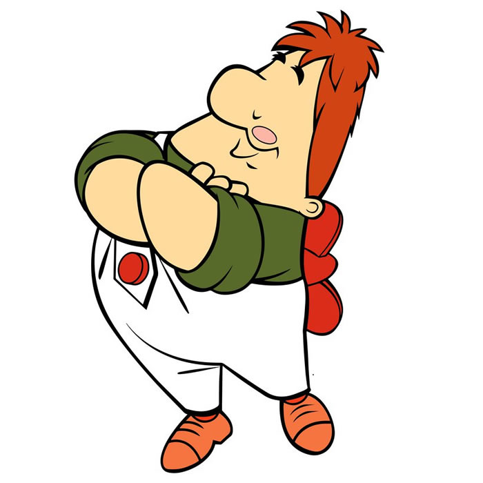

## Имя: Карлсон
## Год рождения: 1955
## Немного о себе
Достаточно эгоистичное лицо с ярко выраженными чертами трикстера

Красивый, умный и в меру упитанный мужчина в самом расцвете сил

- лучший в мире специалист по паровым машинам
- лучший в мире рисовальщик петухов
- лучший в мире мастер скоростной уборки комнат
- лучший в мире специалист по тефтелям
- лучший в мире строитель
- лучший в мире мастер на всевозможные проказы
- лучший в мире бегун
- самый тяжёлый больной в мире
- лучший в мире шутник
- лучшая в мире нянька
- лучший в мире пожарный
- лучший в мире выдумщик
- лучшее в мире привидение

## Сверхспособность - умение летать

